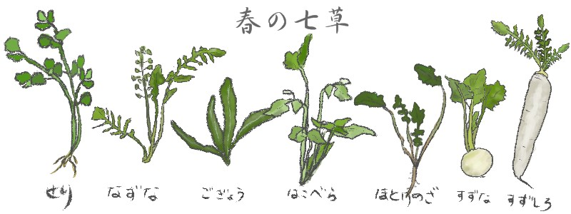

## :four_leaf_clover: Nanakusa Network

Front-end repository management application for a tiny web PaaS project.

### Features

- User registration and login
- List current user's repositories with their git-remote address and web link
- Create new repository on the web

### Framework

Using [limonade](https://github.com/sofadesign/limonade), a PHP micro-framework.

### Server-side implementation

See [ganmacs/cloud-paas](https://github.com/ganmacs/cloud-paas)

To access server-side codes for lxc-containers, front-end implementation executes a shellscript in the specific directory. This strategy is something like brute-force, so it should be fixed.

### Acknowledgement

We are using awesome illustration by [イラストテンプレート美里音](http://www.templatemillion.com/).